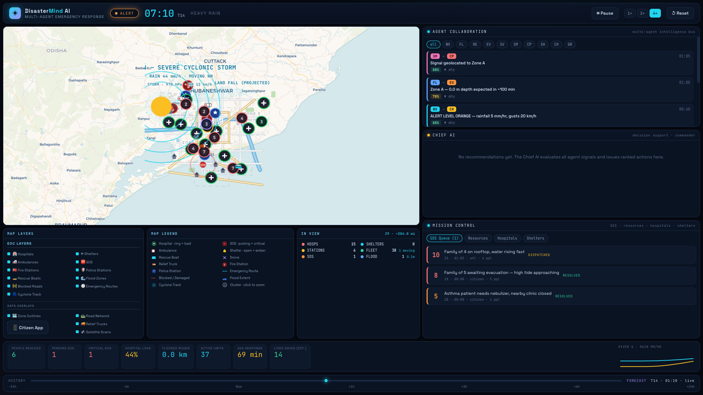
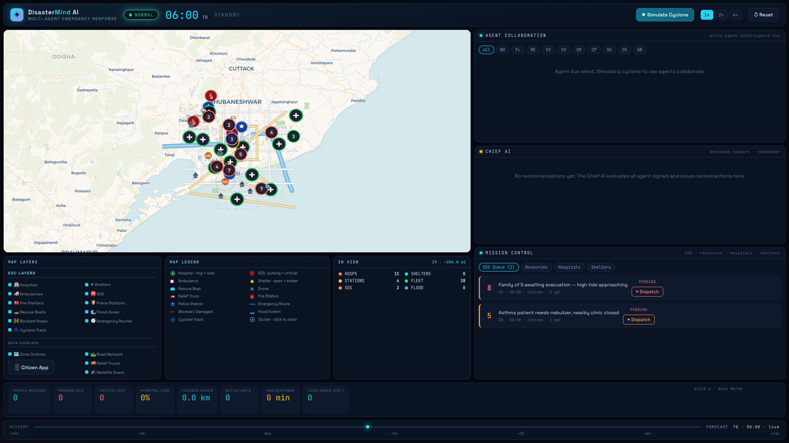
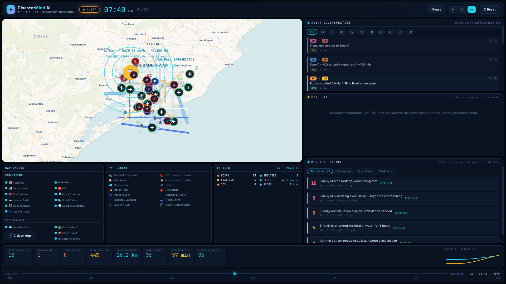
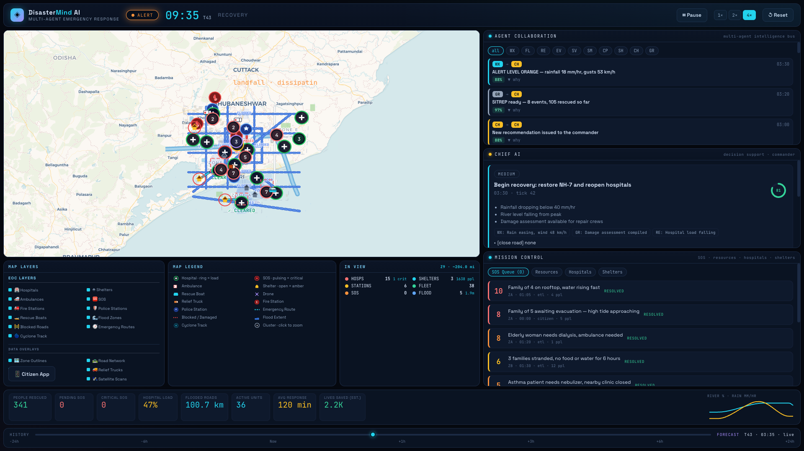

# DisasterMind AI

> A multi-agent emergency response platform that turns a simulated cyclone landfall into coordinated, explainable emergency decisions.

**[Live Demo](https://disastermind-ai.vercel.app)** • **[GitHub](https://github.com/vardhan23v/Disastermind-ai)** • **Hackathon Submission**



⚠️ **DEMO SIMULATION** — DisasterMind AI uses synthetic data and a deterministic simulation. It is a hackathon prototype and must not be used for real-world emergency response decisions.

[](https://reactjs.org/)
[](https://www.typescriptlang.org/)
[](https://vitejs.dev/)
[](https://zustand-demo.pmnd.rs/)
[](https://leafletjs.com/)
[](https://recharts.org/)
[](https://vitest.dev/)
[](https://github.com/parallax/jsPDF)

---

## Why DisasterMind AI?

During a disaster, critical information is fragmented across weather feeds, road closures, hospital capacity, emergency calls, shelters, and field responders. Commanders lose minutes stitching it together by hand.

DisasterMind AI creates a **digital twin of the affected city** and lets specialized agents continuously analyze the situation and coordinate response actions.

The system keeps humans in control:

**AI recommends → Commander reviews → Commander approves → City responds.**

---

## Screenshots

| Initial state | Active cyclone |
| --- | --- |
|  |  |

| Chief AI recommendation | Post-disaster operations |
| --- | --- |
|  |  |

---

## The 10 Agents

A deterministic multi-agent simulation architecture designed for **explainable and reproducible** emergency decision support. Each agent is a pure, independently replaceable decision module over the shared world state.

| Agent | Responsibility |
| --- | --- |
| Weather | Rainfall, wind & cyclone intelligence |
| Flood | Flood spread & road prediction |
| Resources | Hospital & emergency capacity pressure |
| Evacuation | Dynamic emergency routing & logistics |
| Satellite | Damage detection from space |
| Social | Crowd-sourced incident intelligence |
| Call Priority | SOS triage & escalation |
| Shelter | Shelter recommendation & occupancy |
| Chief AI | Decision support & commander briefing |
| Government SITREP | Automated report generation |

The current prototype uses deterministic agent policies so the entire demo is repeatable. The architecture allows any agent to be individually swapped for a live AI/ML model without touching the rest of the system.

---

## Demo Story — 2-Minute Walkthrough

1. 🟡 Cyclone detected offshore
2. 🌧️ Rainfall intensifies
3. 🌊 Flood zones expand on the map
4. 🚨 SOS incidents rise as citizens report
5. 🛣️ Roads get blocked; emergency routes recalculate
6. 🚑 Fleet automatically redeploys
7. 🏥 Hospital capacity approaches critical
8. 🧠 Chief AI recommends mass evacuation
9. 👤 Commander approves the recommendation
10. 🚑 Ambulances, boats & relief trucks dispatch
11. 🏠 Shelter occupancy rises
12. 📋 Automated SITREP is generated for authorities

---

## Stack

| Concern | Choice |
| --- | --- |
| UI | React 18 + TypeScript 5 |
| Build | Vite 5 |
| State | Zustand |
| Map | Leaflet + custom SVG overlay |
| Charts | Recharts |
| Reporting | jsPDF + autotable |
| Testing | Vitest |

## Getting started

```bash
npm install
npm run dev      # http://localhost:5173
```

```bash
npm test         # unit + component tests (vitest)
npm run lint     # eslint, zero warnings tolerated
npm run build    # tsc typecheck + vite production build
npm run preview  # serve the production build locally
```

## Architecture

The data flow is a deliberate unidirectional loop:

```
setInterval → simulationStore(tickWorld) → WorldState
                                              │
              ┌──────────────┬───────────────┤
              │              │               │
        agent modules   dispatch engine   mission/analytics
              │              │               │
              └──────────────┴───────────────┘
                                              │
                       React features (map, ops, sitrep, timeline)
```

### Simulation core — `src/simulation/`

- `engine.ts` — pure, total state transition functions (`createInitialWorld`, `tickWorld`). No I/O, no time dependency; the entire scenario is deterministic and reproducible.
- `dispatch.ts` — vessel / vehicle routing over a hand-written road graph, with pacing calibrated to simulated speed.
- `forecast.ts`, `roadGraph.ts`, `sitrep.ts`, `ids.ts` — hazard progression, pathfinding, situation-report aggregation, stable IDs.
- `engine.test.ts` — contract tests over the tick pipeline.

The clock lives in `src/store/simulationStore.ts`: a `setInterval` scaled by simulation speed (up to 4×), the single authoritative driver for every screen.

### Agents — `src/agents/`

Pure decision functions (no React) that turn world state into agency-specific intelligence. Each module is independently replaceable and fault-injectable.

### Features — `src/features/`

- `map/MapView.tsx` — Leaflet base + SVG overlay for zones, flood, fleet, and labels. Screen-space clustering, hover tooltips, toggleable layers (`PRIMARY_LAYERS` / `EXTRA_LAYERS`).
- `ops/OpsColumn.tsx` — agent feed, commander brief, mission control (SOS / resources / hospitals / shelters).
- `chrono/` — mission clock, phase control, pause/reset, speed, and the forecast timeline scrubber.
- `analytics/` & `sitrep/` — charts and an executive situation report with PDF export.

### Data — `src/data/`

`city.ts` (geometry, zones, road graph), `resources.ts` (hospitals, shelters, stations, fleet), `corpus.ts` (localized reports). All synthetic.

---

## Deployment

- **Live**: https://disastermind-ai.vercel.app (Vite build, `dist/`, auto-deployed via `vercel --prod`).
- **CI**: a GitHub Actions workflow runs `lint`, `test`, and `build` on every push.

---

Made with ❤️‍🩹 by [vardhan](https://github.com/vardhan23v)